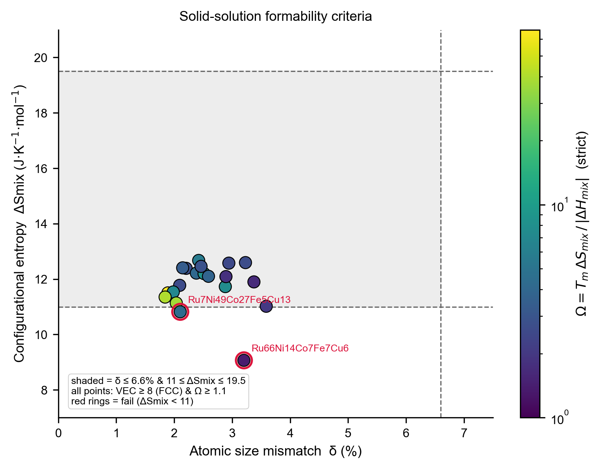
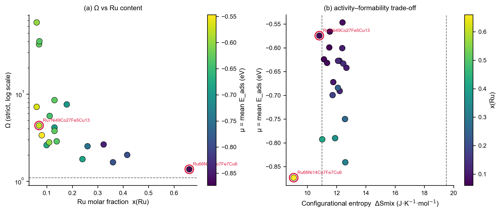

# HEA-H-adsorption-MLIP

> 中文简介：用 MACE-MP-0 通用机器学习原子势，高通量筛选五元高熵合金（Ru–Ni–Co–Fe–Cu）fcc(111) 表面的 H 吸附能，再用成分级机器学习代理模型（μ/σ 双目标 + 高斯过程主动学习）加速组分搜索。

Machine-learning-guided screening of hydrogen adsorption on high-entropy-alloy (HEA) surfaces, powered by the [MACE-MP-0](https://github.com/ACEsuit/mace) foundation model.

## What this does

The adsorption energy of H on an alloy surface is a key descriptor for catalytic (hydrogen evolution, hydrogenation) and hydrogen-storage activity. Enumerating every composition × arrangement × site is intractable for a 5-component HEA, so this workflow:

1. **Screens** H adsorption energies `E_ads` on the fcc(111) surface with a MACE-MP-0 machine-learning interatomic potential (fast, near-DFT accuracy for these systems), then
2. **Learns a cheap surrogate** from the computed data — composition → {mean μ, spread σ} of `E_ads` — and uses **Gaussian-process active learning** to recommend the next composition to compute, closing the loop.

## The pipeline (five parts)

| # | Script | Role |
|---|--------|------|
| 1 | `hea_screening.py` | Build slabs, relax, place H, and compute `E_ads = E(slab+H) − E(slab) − 0.5·E(H₂)` over a random quinary composition set |
| 2 | `hea_mu_sigma_model.py` | Aggregate per-composition μ/σ and fit leave-one-composition-out surrogates (GP for μ, random forest for σ) |
| 3 | `hea_gp_active_learning.py` | Fit a GP on computed compositions and recommend the next composition via lower-confidence-bound acquisition |
| 4 | `hea_make_figures.py` | Reproduce the paper figures (Fig 1–8), including PCA / pentagon-simplex composition maps |
| 5 | `hea_formability.py` | Compute synthesizability criteria δ / ΔSmix / Ω / VEC and the formability map (Fig 9) |

`hea_ref_energies.py` is a small helper that computes the per-element fcc-vs-ground-state reference energies once, for the strict mixing-enthalpy (Ω) convention.

## Headline results (MACE-MP-0, 25 compositions, 2500 site relaxations)

- μ = mean `E_ads`: leave-one-composition-out GP reaches **R² = 0.94**.
- σ = std of `E_ads`: random forest reaches **R² = 0.68** (after filtering diverged relaxations).
- **Configurational disorder homogenizes the surface**: pure metals have σ ≈ 0.28 eV, while five-component HEAs drop to σ ≈ 0.12 eV — a non-intuitive, publishable finding.
- Valence electron concentration (VEC) is the strongest single-element descriptor; active learning naturally recommends Ru-rich compositions (most negative μ).
- **Synthesizability**: all 20 quinary compositions pass δ ≤ 6.6%, Ω ≥ 1.1, and VEC ≥ 8 (FCC); 18/20 also pass 11 ≤ ΔSmix ≤ 19.5 J/(K·mol). The two failures are the most skewed compositions (e.g. `Ru66Ni14Co7Fe7Cu6`, ΔSmix = 9.1) — a direct activity–formability trade-off, since those same Ru-rich compositions are the most catalytically active.

## Repository layout

```
.
├── hea_screening.py           # Part 1: MACE screening (writes data/hea_h_adsorption.csv)
├── hea_mu_sigma_model.py      # Part 2: composition → μ/σ surrogate
├── hea_gp_active_learning.py  # Part 3: GP + LCB active learning
├── hea_make_figures.py        # Part 4: figures
├── hea_formability.py         # Part 5: synthesizability criteria (δ/ΔSmix/Ω/VEC) + Fig 9
├── hea_ref_energies.py        # helper: per-element fcc-vs-ground-state energies (strict ΔHmix)
├── data/
│   ├── hea_h_adsorption.csv       # per-site E_ads (shipped; regenerate with Part 1)
│   ├── hea_formation_enthalpy.csv # per-composition ΔH_form
│   └── hea_pure_reference.csv     # per-element E_ground / E_fcc / ΔE_struct
├── requirements.txt
└── README.md
```

## Installation

```bash
# 1. (optional but strongly recommended) install PyTorch with CUDA for your GPU:
#    pip install torch --index-url https://download.pytorch.org/whl/cu121
# 2. install the rest:
pip install mace-torch ase scikit-learn pandas matplotlib numpy
```

`hea_screening.py` uses `device="cuda"`; set `DEVICE = "cpu"` in the config block (or export `CUDA_VISIBLE_DEVICES=`) if you have no GPU.

## Model weights

Part 1 needs the MACE-MP-0 model `2023-12-03-mace-128-L1_epoch-199.model` (~44 MB). Download it from the MACE foundation-model releases (GitHub `ACEsuit/mace`, or the HuggingFace mirror), then either

```bash
export MACE_MODEL_PATH=/path/to/2023-12-03-mace-128-L1_epoch-199.model
```

or place the file next to `hea_screening.py`. The weight file is **not** committed to this repo.

## Usage

### Part 1 — screening

```bash
python hea_screening.py
```

Config lives at the top of the file: `ELEMENTS`, `COMP_MODE="pure+random_quinary"`, `N_QUINARY`, `N_CONFIGS`, `N_SITES`. Outputs `data/hea_h_adsorption.csv` (per-site `E_ads`) and `data/hea_formation_enthalpy.csv` (per-composition `ΔH_form`). It **resumes** from an existing CSV (断点续跑) — safe to interrupt and re-run.

### Part 2 — μ/σ surrogate

```bash
python hea_mu_sigma_model.py
```

Reads `data/hea_h_adsorption.csv`, aggregates to per-composition μ/σ, and reports leave-one-composition-out R²/RMSE for GP and RF.

### Part 3 — active learning

```bash
python hea_gp_active_learning.py
```

Fits a GP on the computed compositions and prints the top-K next compositions (LCB acquisition). Add them to the composition list in Part 1, compute, append to the CSV, and re-run to iterate.

### Part 4 — figures

```bash
python hea_make_figures.py
```

Writes Fig 1–8 to `figures/` at 300 dpi.

### Part 5 — synthesizability assessment

```bash
python hea_ref_energies.py   # optional but recommended: compute strict-ΔHmix reference energies
python hea_formability.py    # prints δ/ΔSmix/Ω/VEC + pass/fail, writes figures/fig9_formability.png
```

## Data format

`data/hea_h_adsorption.csv` — one row per H adsorption site:

| column | meaning |
|--------|---------|
| `comp` | composition label, e.g. `Ru42Ni35Co9Fe10Cu5` |
| `comp_idx`, `cfg`, `site_idx` | composition / arrangement / site indices |
| `site_type` | ideal site: `top` / `bridge` / `fcc` / `hcp` |
| `local_env` | coordination element string of the ideal site |
| `act_site_type`, `act_local_env` | actual site after relaxation (H often migrates top/bridge → hollow) |
| `h_height`, `d_xy` | H height / lateral displacement |
| `E_slab`, `E_slabH` | clean slab / slab+H energies (eV) |
| `E_ads` | adsorption energy (eV) |

## Synthesizability criteria

`hea_formability.py` computes four classic HEA solid-solution formability indicators for every composition:

| indicator | criterion | meaning |
|-----------|-----------|---------|
| atomic size mismatch δ | ≤ 6.6% | small mismatch → solid solution forms |
| mixing entropy ΔSmix | 11–19.5 J/(K·mol) | enough configurational entropy to stabilise the solid solution |
| Ω = Tm·ΔSmix / \|ΔHmix\| | ≥ 1.1 | entropy outweighs enthalpy → single-phase solid solution |
| VEC | ≥ 8 (FCC), < 6.87 (BCC) | predicted crystal structure |

δ, ΔSmix, and VEC are pure composition properties (molar fractions + tabulated radii / melting points / VEC). Ω additionally needs the mixing enthalpy ΔHmix, reported in two conventions:

- **proxy**: `|dH_form|` from `data/hea_formation_enthalpy.csv` (MACE, referenced to the elemental ground states hcp-Ru/Co, bcc-Fe).
- **strict**: referenced to the *same fcc lattice* (the standard mixing-enthalpy convention). This needs the per-element structural term `ΔE_struct = E_ground − E_fcc`, computed once by `hea_ref_energies.py` → `data/hea_pure_reference.csv`; `hea_formability.py` picks it up automatically.

> Caveat: when ΔHmix → 0 (near-ideal solid solution) Ω diverges and its *absolute* value is not meaningful — MACE's mixing-enthalpy has limited absolute accuracy. The qualitative conclusion (Ω ≥ 1.1) is robust; validate ΔHmix against Miedema/CALPHAD/DFT before publication.

## Caveats

- **Divergence filter**: relaxations occasionally collapse to unphysical `E_ads` (e.g. H falling into the slab, `E_ads` ≈ −12 eV). Parts 2–4 drop `E_ads` outside the physical window **[−2, +1] eV**.
- **`REF_DFT` in `hea_make_figures.py`** (Fig 3) is a set of approximate literature values and **must be replaced with your own DFT/reference numbers** before publication.
- **Rigid-slab approximation**: for H adsorption the slab is held fixed and only H is relaxed (relaxing the top metal layer with MACE-MP-0 can spuriously reconstruct the surface).

## Figures

Fig 1–8 are generated by `hea_make_figures.py`, Fig 9–10 by `hea_formability.py`, all into `figures/` (300 dpi). They are committed for quick preview.





## Citation

If you use this code or the data, cite the MACE-MP-0 foundation model:

> I. Batatia et al., "A foundation model for atomistic materials chemistry", arXiv:2401.00096.

## License

[MIT](LICENSE)
